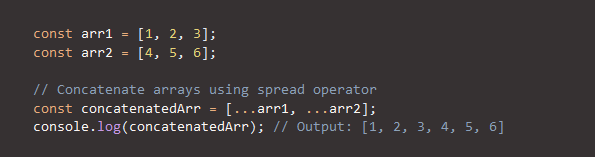
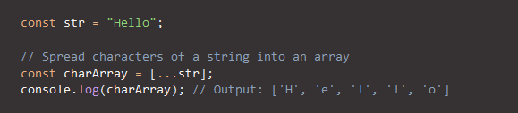
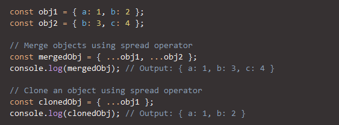
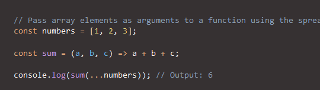

Qu’est-ce que l’opérateur spread dans JavaScript ?

L’opérateur spread dans JavaScript est une syntaxe introduite dans ECMAScript 6 (ES6) qui vous permet d’étaler les éléments d’un itérable (tels que des tableaux, des chaînes de caractères ou des objets) dans un autre itérable ou dans un appel de fonction.

Il est désigné par trois points « ... » suivis d’une expression ou d’un itérable. L’opérateur spread est un outil puissant qui offre un moyen concis et flexible de travailler avec des données dans JavaScript.

Il peut être utilisé pour concaténer des tableaux, créer des copies superficielles de tableaux, convertir des chaînes en tableaux de caractères, fusionner ou cloner des objets et passer dynamiquement des valeurs dans des fonctions ou des constructeurs, entre autres cas d’utilisation.

L’opérateur spread simplifie les opérations complexes et permet d’obtenir un code plus expressif et plus efficace. C’est pourquoi il s’agit d’une fonctionnalité très appréciée des développeurs JavaScript.

1. Concaténation de tableaux

Vous pouvez utiliser l’opérateur d’étalement pour répartir les éléments d’un tableau dans un autre tableau. Cet opérateur est particulièrement utile pour concaténer des tableaux ou créer une copie superficielle d’un tableau.

2. Répartir des chaînes de caractères

Vous pouvez utiliser l’opérateur « spread » pour répartir les caractères d’une chaîne dans un tableau. Cette opération est utile pour convertir une chaîne en un tableau de caractères, qui peut être manipulé ou combiné avec d’autres tableaux à l’aide des méthodes de tableau.

3. Fusion et clonage d’objets

Vous pouvez utiliser l’opérateur spread pour étendre les propriétés d’un objet à un autre objet. Cette fonction est utile pour fusionner ou cloner des objets, créer un nouvel objet dont certaines propriétés sont remplacées ou extraire des propriétés spécifiques d’un objet.

4. Répartir des arguments de fonction

L’opérateur spread peut également être utilisé dans d’autres contextes, tels que les arguments de fonction, pour passer des valeurs de manière dynamique dans une fonction ou un constructeur.

